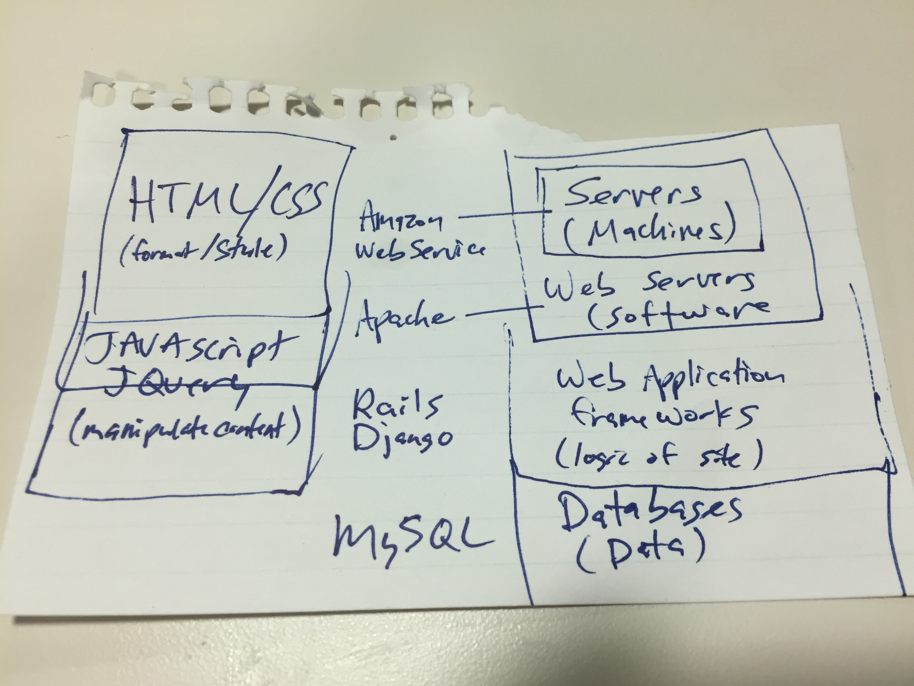

A year ago, with no programming experience, I set out to learn [Cold Fusion](http://www.adobe.com/products/coldfusion-family.html).  At work I was responsible for a report that people updated on the web.  The day before I decided to fix the form and change some of the fields.  The developer in my organization said, “Sure you can make the changes yourself, you just have to learn [Cold Fusion](http://www.adobe.com/products/coldfusion-family.html).”  I hadn’t programmed before, but I’d built a few Access databases.  I decided to give it a shot.  After two frustrating days trying to get everything installed and configured, I was able to start on the [Learn CF in a Week](http://www.learncfinaweek.com/) tutorial.  I don’t think he expected me to take him up on the offer, but I was back the next week to let him know I was working on learning it.  That initiative kind of fizzled when I wasn’t able to get an [IDE](https://en.wikipedia.org/wiki/Integrated_development_environment) (which I had to look up) installed on my computer, but a seed had been planted.

I spent the next week learning how the web worked and emerged from my studies with this sketch and a desire to learn web development in 2016.



I did some research on the “best” languages to learn (see notes below) and settled on [Ruby](https://www.ruby-lang.org/en/) and [Rails](http://rubyonrails.org/).  Before I started on [Ruby](https://www.ruby-lang.org/en/) , I spent a week or two learning [HTML](http://www.w3schools.com/html/), [CSS](http://www.w3schools.com/css/), and [JavaScript](https://www.javascript.com/) on [Code School](https://www.codeschool.com/).  Once I had a basic understanding of those, I started on [Learn Ruby the Hard Way](https://learnrubythehardway.org/book/) and shortly thereafter the [Ruby on Rails Tutorial](https://www.railstutorial.org/book).  [Learn Ruby the Hard Way](https://learnrubythehardway.org/book/) gives you the foundation to understand what’s going on in your code, but the [Ruby on Rails Tutorial](https://www.railstutorial.org/book) got me hooked...within 15-20 minutes I had deployed a “[Hello World](https://en.wikipedia.org/wiki/%22Hello,_World!%22_program)” app to the internet!!

A few years ago, my friends created a Fantasy Sports League with unique rules they call The 338 Challenge.  Instead of picking players, you pick teams (or individuals in sports like golf).  If your team wins the championship or places in the top 8 you get points.  There are 14 different sports leagues, everything from the NFL to the Kentucky Derby.  Since the league started, it has grown to 2 divisions with 28 total teams.  The commissioner was keeping track of everything with spreadsheets, all communication was done via email, and he updated the HTML website by hand.  Once he learned I was learning programming, he asked if I could help him make a new website.  So in February I started playing around to see if this website was something I would be able to put together.  The good news was the next season didn't start until August so I had 6 months to put it together.  Now I had a real project!

After that, I spent my time between building out the Fantasy Sports website and learning more about Ruby, Rails, and programming.  About the time my Fantasy Sports website was what I would consider a minimal viable product ([MVP](https://en.wikipedia.org/wiki/Minimum_viable_product)), I started getting serious about learning testing.  The first time I read about testing in Learn Ruby the Hard Way [Exercise 47: Automated Testing](https://learnrubythehardway.org/book/ex47.html), it did not make sense to me.  The [Ruby on Rails Tutorial](https://www.railstutorial.org/book) did a good job of introducing the concept, but it didn’t really click until I started making my real app.  Things would break as I added new features or tried to improve my code with better design or style, so I had to click through my site to make sure things were still working.  I realized it would be much easier to write automated tests rather than clicking around after every change. I spent a few weeks learning testing and quickly realized my MVP with no tests was not going to work.  

So in April, I started rebuilding the app using [Test Driven Development](https://en.wikipedia.org/wiki/Test-driven_development) as much as possible.  It went fairly fast because I had already figured out a lot the overall design.  By early June, my app, [the-338-challenge](https://github.com/axelclark/the-338-challenge) had much better test coverage and had more features than my earlier MVP.

I’m learning programming as a hobby and don’t intend to change careers in the near future, so I have some flexibility to learn and explore whatever I find interesting.  At this time I was hearing a lot about [Elixir](http://elixir-lang.org/) and began playing around with it.  Its syntax is similar to [Ruby](https://www.ruby-lang.org/en/), so it wasn’t as intimidating as some of the other “hot” langauges I was playing with.  I was considering rebuilding my app in Elixir and then I heard a Bike Shed episode titled [You’re an Elixir Developer Now](http://bikeshed.fm/52).  I really enjoy listening to the [Bike Shed].  Sean Griffin ([@sgrif](https://twitter.com/sgrif)) and Derek Prior ([@derekprior](https://twitter.com/derekprior)) are really fun hosts and I used the podcast to become more familiar with more advanced programming issues.  In this episode, Derek mentioned he was loving Elixir and would probably build any new [green field project](https://en.wikipedia.org/wiki/Greenfield_project) in [Elixir](http://elixir-lang.org/) and [Phoenix](http://www.phoenixframework.org/). I decided what the heck, it sounds like a good challenge and set out to learn Elixir and Phoenix.  I started my new Elixir app, [ex338](https://github.com/axelclark/ex338), in early July.  

By early August I had built the app a third time and had features in place for the site to be essentially a static site to the user, with admin pages for the commissioner to update information in the database.  I had built login functionality, but the users still had to email in their draft picks.  About a week before the draft the commissioner and I were talking. He asked if I could add a feature to let users draft through the site.  I would not have implemented the feature unless my buddy mentioned it, but I got to work and was able to put it in place before the draft.  It was a hit with the users!  Since then, we’ve added features to add and process waivers (adding a team or player that is currently unowned).  I’ve also learned a ton about the issues you face with a deployed app and real users.
  
I left JavaScript in the “Not for now” bucket until I ran into a problem where [JavaScript](https://www.javascript.com/) was going to be the best solution...filtering a drop down for making a draft pick.  In my initial [ex338](https://github.com/axelclark/ex338) implementation, the drop down to select a draft pick had every possible team and player (about 450 options.)  This was really clunky and a pain to scroll through, especially on mobile.  After a little bit of research, I realized the filter was best done in the browser, so I set out to learn JavaScript.  Here is my first JavaScript code (it also needed to add classes to the options), relying heavily on [jQuery](https://jquery.com/).
```javascript
var $ = require('jquery');

$(document).ready(function() {
  
  $('.players-to-filter').find("option").each(function(){
    var txt = $(this).text();
    var player_array = txt.split(" ");
    var league = player_array[player_array.length -1];
    $(this).addClass(league);
  });
  
  var allOptions = $('.players-to-filter option');

  $('.sports-select-filter').change(function () {
    $('.players-to-filter option').remove()
    var sportsLeague = $('.sports-select-filter option:selected').prop('text');
    var opts = allOptions.filter('.' + sportsLeague);
    $.each(opts, function (i, j) {
      $(j).appendTo('.players-to-filter');
    });

    $('.players-to-filter option:eq(0)').prop('selected', true);
  });
});
```
Now it looks relatively simple, but that took me hours to figure out!  At least when I updated the site, the users really appreciated the change.

This fall, I was reading a lot about Elixir and Phoenix as a JSON API (e.g. [Building and testing a Phoenix JSON AIP](https://robots.thoughtbot.com/building-a-phoenix-json-api)) for a JavaScript frontend (e.g. [React](https://facebook.github.io/react/), [Angular](https://angular.io/), [Elm](http://elm-lang.org/)).  I had avoided JavaScript because I wasn’t ready to dive into it yet.  However, after my time spent learning JavaScript basics to implement my filter, I decided to check out one of these frontends.  I decided to learn [React](https://facebook.github.io/react/) and eventually [Redux Tutorial](http://redux.js.org/).  My buddy Matt is learning JavaScript too, so we were excited to try working together on a project.  

Starting off, I had no idea how JavaScript called APIs on the web to get data, i.e. how the frontend and backend linked up.  I took some time researching how that worked and suggested we build an app to provide the status of Metro trains in DC.  Initially I was excited to include a Elixir/Phoenix backend, but soon realized it would be simpler initially just to call the [WMATA developer API](https://developer.wmata.com/docs/services) directly from the browser.  Currently we have a very bare bones implementation, [metroApp](https://github.com/WojoSite/metroApp), we are using to learn React and Redux fundamentals.

Finally, as I was learning React fundamentals, I came across [Gatsby](https://github.com/gatsbyjs/gatsby) which uses React to build static sites.  I started playing around with it and built a simple blog site, [simple-blog](https://github.com/axelclark/simple-blog).  Unfortunately, I had a blog, but no content so I decided to write a blog post about my year learning programming and here it is!

That’s the story of my year.  The next section is a collection of notes I made about what worked and didn't work for me.  In the 3rd section, I’ve listed my favorite resources.
       
## My Notes
### What language?
I didn’t realize it a year ago, but when you learn your first language, the language itself is the tip of the iceberg.  I think it is helpful to find a language with tutorials and books to learn very beginner and intermediate programming fundamentals using the language as examples.  I spent a few weeks looking around trying to make a decision on a language.  

I think Ruby is a good choice because there are a ton of resources to learn the non-language aspects of programming.  For example, how the web works ([Learn Rails](http://learn-rails.com/) Book One, Development Environment Setup, Git & GitHub Workflow, Deployment, ([Ruby on Rails Tutorial](https://www.railstutorial.org/book)), Testing/Programmer Tools ([Upcase](https://thoughtbot.com/upcase/)) & Design Patterns (Practical Object Oriented Design in Ruby, i.e [POODR](http://www.poodr.com)).

Ultimately though, I wouldn’t worry a whole lot about picking a language.  If you want to switch, the 2nd language is much easier because you won’t be learning the fundamentals of programming at the same time.   

### Language or framework first?
I started learning both and picked whatever I found most enjoyable on that day.  I would bounce back and forth as sections got boring or I felt like I was wading too far out in the framework “deep end” and didn’t understand what was going on.  It probably depends on if you learn better from the bottom up (learning the concepts in depth bit by bit) or top down (learn overall how everything fits together and then go back to learn the details).

### Type, Don’t Cut & Paste
It really helps me to type out the code rather than cut and pasting. Many people have said it, but it’s kind of like reading about skiing vs going to the mountain.  You aren’t going to get it until you get out on the slopes.  The same is true for actually typing code.  Get your fingers and mind used to typing the syntax.  However, there are some times I’ll just paste in the code if it's a topic I plan on coming back to.  For example, I skipped over the CSS in [Ruby on Rails Tutorial](https://www.railstutorial.org/book) the first time and just pasted it in.  I also skipped through JavaScript sections in [Programming Phoenix](https://pragprog.com/book/phoenix/programming-phoenix) my first time through.  I read through those sections, but I knew I wasn’t getting a great understanding and made a mental note to go back when I wanted to get depth in those areas. 

### Errors, Bugs, and Typos
Typing out all of the code helped me learn the lesson that 95% of my errors or bugs are typos.  On multiple occasions when going through the [Ruby on Rails Tutorial](https://www.railstutorial.org/book) I had an error I couldn’t figure out.  When I searched StackOverflow, someone else had already posted the error...haha, we had the same typo.  It’s one benefit of having a bunch of people try to learn programming with the language before you. 

### Twice Through the Tutorial
The first time through a tutorial, if I don’t get a concept, I just keep going and make a mental note to look for ways to better understand it.  I like to understand how the pieces fit together first, so I often end up doing a tutorial twice.  When I go back through the tutorial, I understand how things fit together so it is easier for me to understand the more challenging topics.  Many times the concept I struggled on the first time makes sense once I understand how everything fits together.   

### Find a Project
It was helpful for me to find a project once I finished a couple tutorials (before I had a basic understanding, it was hard to know what was reasonable to build when starting out.)  The main project I picked was building a fantasy sports app.  As I mentioned above, I built it 3 times.  Picking the next thing to learn was easier because it was based on the next feature I was trying to add to my app.  It also create the right about of stress and urgency for me to break through barriers as I was learning.

### Intermediate Learning Without Becoming Overwhelmed
There is a ton to learn and it can be overwhelming.  Justin Weiss give a lot of great advice about learning Rails as an intermediate, e.g. [With So Much Rails to Learn, Where Do You Start?](https://www.justinweiss.com/articles/with-so-much-rails-to-learn/).  The most important thing I learned from him (I think it was from either his book or a blog post), is the importance of your “Not for now” list.  The large list of things you are setting aside so you can focus on learning one or two things in depth.   

### Borrowing Code for Your Project
There were a lot of opportunities to take pieces of tutorials and modify them to fit my project.  One advantage of going through multiple tutorials is I had a bunch of patterns and ideas for how to solve problems when you will run into them in your project.  For example, I used the Wes Bos [Learn Redux](https://learnredux.com/) tutorial app Reduxtagram to model [MetroApp](https://github.com/WojoSite/metroApp).  For one of my next features in this app, I plan on using the implementation of the FilteredTodo from the Redux docs [Todo List tutorial](http://redux.js.org/docs/basics/ExampleTodoList.html) to add a filter for the list of metro stations.

### StackOverflow and Documentation
StackOverflow can help you find something when you don’t know what you are looking for.  However, as I’ve learned more, the docs have become more and more useful.  Part of that may be because Elixir has great docs and there isn’t as much info on Stack Overflow (btw, the Elixir Forum is a great resource if you run into problems with Elixir...pretty cool when the creator of the language [answers your question](https://elixirforum.com/t/data-confirm-and-data-disable-in-forms/1633/3).

### Watch the Pros
One of my favorite part of screencasts was learning even the pros make typos and other mistakes.  They also have to reference the docs and look stuff up.

### Reading Open Source
I’ve tried to read more open source code.  I found libraries were tough to understand at first.  I joined Upcase which is a learning site from Thoughtbot and maybe the best thing about it was getting access to the Upcase repo.  The structure generally mirrored my app, so I could see how they solved problems similar to what I was working on.  Now that I’m more experienced, I’ve found libraries useful for style and understanding how people organize classes/methods, and modules/functions.  Reading more open source code is something I plan to work on in 2017.

### Taking a Break
When I hit a roadblock and I start forcing a solution, I need to step away from the problem.  So many times I’ve struggled for an hour or two and then the next morning I see the problem in 5 or 10 minutes.  This is a tough one because it feels like you’re right on the edge of figuring it out...if I just play around with it for a few more minutes!  ...nope, time to take a break.

### Pairing and Finding a Mentor
Another one of my goals for 2017 is to look into remote pairing and maybe learn more “in person” from a more experienced programming.  I feel like a lot of the authors of the books I’ve used are my mentors, but seeing how experienced programmers work would probably help me learn more quickly.

## List of My Favorite Resources
Many books and tutorials are available online for free.  If I find them useful, I buy a copy to support the author.
### General
* [Code School](https://www.codeschool.com/):  A good introduction to [HTML](http://www.w3schools.com/html/), [CSS](http://www.w3schools.com/css/), and [JavaScript](https://www.javascript.com/).  The courses made it easy to get started when I was brand new. 
* [Imposter’s Handbook](https://bigmachine.io/products/the-imposters-handbook/) by Rob Conery ([@robconery](https://twitter.com/robconery)):  If you really get into programming, this book will give you an introduction to many computer science topics.
### Ruby/Rails
#### Beginner
* [Learn Ruby the Hard Way](https://learnrubythehardway.org/book/) by Zed A. Shaw ([@lzsthw](https://twitter.com/lzsthw)):  A great introduction to programming in Ruby.
* [Learn Rails](http://learn-rails.com/) by Daniel Kehoe ([@rails_apps](https://twitter.com/rails_apps)):  Book 1 is the best introduction I found about how the web works.
* [Ruby on Rails Tutorial](https://www.railstutorial.org/book) by Michael Hartl ([@mhartl](https://twitter.com/mhartl)):  Without question my favorite tutorial. It teaches you important fundamentals of software development and the explanations are excellent.  In fact, you could also check out his [Learn Enough series](https://www.learnenough.com/)
* [Rails Guides](http://guides.rubyonrails.org/):  These guides are really helpful and I refer to them all the time when I’m working in Rails.
#### Intermediate
* [Practicing Rails](https://www.justinweiss.com/practicing-rails/) by Justin Weiss ([@justinweiss](https://twitter.com/justinweiss)):  An excellent guide for learning intermediate concepts once you get the basics.
* [Upcase](https://thoughtbot.com/upcase/):  An amazing resource for not just Rails, but all kinds of software development tools and best practices.  Convinced me to learn VIM and now I’m hooked!
* [Thoughtbot Guides](https://github.com/thoughtbot/guides):  A bunch of real world guides for software development.  I use their [Git Protocol guide](https://github.com/thoughtbot/guides/tree/master/protocol/git) every time I’m committing changes to my master branch(i.e. saving my changes).
* [Practical Object-Oriented Design in Ruby](http://www.poodr.com/) by Sandi Metz ([@sandimetz](https://twitter.com/sandimetz)):  Once you have a basic understanding of the langauge and have some experience, this is a good book to introduce design patterns.  Here is where learning Ruby is helpful.  You can learn the design patterns in a language you understand.
* [Bike Shed](http://bikeshed.fm/) with Sean Griffin ([@sgrif](https://twitter.com/sgrif)) and Derek Prior ([@derekprior](https://twitter.com/derekprior)):  An excellent podcast to become familiar with programming terms and concepts.  The episode [You’re an Elixir Developer Now](http://bikeshed.fm/52) convinced me to learn Elixir and Phoenix and build my app a third time.
* [Giant Robots](https://twitter.com/giantrobots) with Ben Orenstein ([@r00k](https://twitter.com/r00k)):  A fun mix of business, self development, and programming.
### Elixir/Phoenix
#### Beginner/Intermediate
* [Elixir Guides](http://elixir-lang.org/getting-started/introduction.html):  A great starting point if you are interested in Elixir. 
* [Phoenix Guides](http://www.phoenixframework.org/docs/overview):  Get an overview of Phoenix.
* [Taking Off With Elixir](https://bigmachine.io/products/take-off-with-elixir/) by Rob Conery ([@robconery](https://twitter.com/robconery)):  A fun tutorial built into a story.  The exercises were the best resource I found to understand pattern matching.
* [Programming Elixir](https://pragprog.com/book/elixir/programming-elixir) by Dave Thomas ([@pragdave](https://twitter.com/pragdave)):  The best tutorial for learning the basics of Elixir.
* [Programming Phoenix](https://pragprog.com/book/phoenix/programming-phoenix) by Bruce Tate ([@redrapids](https://twitter.com/redrapids)), Chris McCord ([@chris_mccord](https://twitter.com/chris_mccord)) and José Valim ([@josevalim](https://twitter.com/josevalim)):  The resource for learning Phoenix.  Looking forward to the update for Phoenix 1.3.
* [Elixir in Action](https://www.manning.com/books/elixir-in-action) by Saša Jurić ([@sasajuric](https://twitter.com/sasajuric)):  I found it was the best resource to learn OTP in Elixir.
* [Elixir Forum](https://elixirforum.com/):  I would use this over StackOverflow for Elixir/Phoenix questions.  The community is very helpful.
* [Daily Drip](https://www.dailydrip.com/topics/elixir) by Josh Adams ([@knewter](https://twitter.com/knewter)):  A series of short screencasts for learning Elixir topics.
* [Elixir Fountain](https://soundcloud.com/elixirfountain) with Johnny Winn ([@johnny_rugger](https://twitter.com/johnny_rugger):  A fun podcast to hear from the people in the Elixir community.
### JavaScript/React/Redux:
#### Beginner
* [A Smarter Way to Learn JavaScript](https://www.amazon.com/Smarter-Way-Learn-JavaScript-technology-ebook/dp/B00H1W9I6C):  Make sure you actually do the exercises. I could tell I was getting it when I could go through the exercises without consciously thinking about them. 
#### Intermediate
* [You Don’t Know JavaScript](https://github.com/getify/You-Dont-Know-JS) by Kyle Simpson([@getify](https://twitter.com/getify)):  Excellent resource, but gets down in the weeds.  I go back to it to learn concepts when I want to get a more in depth understanding.
* [React Tutorial](https://facebook.github.io/react/tutorial/tutorial.html) and [Redux Tutorial](http://redux.js.org/) by Dan Abramov([@dan_abramov](https://twitter.com/dan_abramov)):  Very good introduction to these libraries.
* [ReactJS Redux, the Right Way](https://reactjs.co/#basic-preface):  This site has an excellent path for learning React & Redux.  
* [Learn Redux](https://learnredux.com/) by Wes Bos ([@wesbos](https://twitter.com/wesbos)):  A good series of screencasts.

Well there you have it, a year learning programming.  If you have any questions, you can find me on Twitter at [@axelclark2](https://twitter.com/axelclark2) or Github at [axelclark](https://github.com/axelclark).  Thanks for reading!
