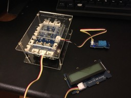
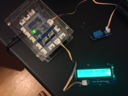
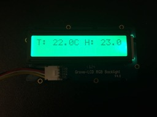

Last year, when I first discovered you can use Elixir with [Nerves Project](http://nerves-project.org/) 
on a Raspberry Pi, I bought a Raspberry Pi and started playing around with a 
"hello world" blinky project. I got [blinky](https://github.com/axelclark/blinky) 
working and progressed to a [traffic light](https://github.com/axelclark/traffic_light) 
project. 

Then I kind of hit a wall trying to learn Serial Peripheral Interface 
bus (SPI) and I2C (Inter-Integrated Circuit) protocols to connect to
sensors. I had a really hard time figuring out how to read datasheets to get the 
protocols to communicate with sensors.  Recently, I discovered the [GrovePi+](https://www.dexterindustries.com/shop/grovepi-starter-kit-raspberry-pi/) and it has helped me break through those challenges to 
start building more interesting projects with my Raspberry Pi. 

This post describes a 
[Home Weather Display](https://github.com/fhunleth/grovepi/tree/master/examples/home_weather_display) 
project to show how easy it is to get started with Nerves and GrovePi. The project 
reads a digital humidity and temperature (DHT) sensor and updates a RGB LCD display 
with the data. The project was inspired by this Python 
[project](https://www.dexterindustries.com/GrovePi/projects-for-the-raspberry-pi/raspberry-pi-temperature-sensor/).

## Required Hardware

This project requires the following hardware (all Grove hardware, except the 
case, came with the 
[GrovePi+ Base Kit](https://www.dexterindustries.com/shop/grovepi-starter-kit-raspberry-pi/) 
I purchased to get started):

  * Raspberry Pi + SD card
  * GrovePi+ or GrovePi Zero (I used a GrovePi+, but a GrovePi Zero works as
    well)
  * GrovePi case (optional)
  * Grove DHT11 Sensor (the blue one)
  * Grove RGB LCD display
  * Grove Connection wires x 2 

## Hardware Setup

1. Follow the instructions included with your GrovePi+ to attach your GrovePi+ to your Raspberry Pi. 

2. On the GrovePi+ (or GrovePi Zero), connect a DHT11 to port D7 and a RGB LCD display 
to the IC2-1 port.

Here is a picture of everything set up on my GrovePi+.



## Initial Project Setup

1. Install Nerves using these [instructions](https://hexdocs.pm/nerves/installation.html) 
if you don't already have it installed.

2. Run `mix nerves.new home_weather_display` in your shell and enter `y` for `fetch 
and install dependencies?`.

3. Follow the [GrovePi application](https://github.com/fhunleth/grovepi) instructions 
to add grovepi to your deps:

  * Note:  The DHT module I'm using will be in GrovePi release 0.3.3 and later. 
Until then it is available from master.

```elixir
def deps do
  {:grovepi, github: "fhunleth/grovepi"}
end
```

4. Run `mix deps.get` to download the dependencies. 

## Programming the Home Weather Display

The [GrovePi](https://github.com/fhunleth/grovepi) application lets you interact 
with the GrovePi+ and any connected sensors in Elixir. It will automatically start 
with your application and initiate a connection to the GrovePi+ board.

You can use `GrovePi.Digital` ([docs](https://hexdocs.pm/grovepi/GrovePi.Digital.html#content)) 
or `GrovePi.Analog` ([docs](https://hexdocs.pm/grovepi/GrovePi.Analog.html#content)) 
to directly interact with sensors.  However, we are going to use the
`GrovePi.DHT` and `GrovePi.RGBLCD` modules to more easily communicate with these 
components.

### Polling on the DHT

The `GrovePi.DHT` module uses the `GrovePi.Poller` behaviour and allows you to poll 
(i.e. read at regular intervals) your DHT sensor.

1. Add the `GrovePi.DHT` module into your supervision tree in
`lib/home_weather_display/application.ex`. Also include the `@dht_pin` and 
the `@dht_polling_interval` which is an optional argument. The default polling 
interval is .1 seconds which is more frequent than needed for our project, so 
we'll use 1_000 ms or 1 second. Adding the `GrovePi.DHT` module as a worker starts a 
GenServer for polling on your DHT sensor connected to port D7.


```elixir
lib/home_weather_display/application.ex

defmodule HomeWeatherDisplay.Application do
  use Application

  @dht_pin 7 # Use port D7 for the DHT
  @dht_poll_interval 1_000 # poll every 1 second

  def start(_type, _args) do
    import Supervisor.Spec, warn: false

    children = [
      worker(GrovePi.DHT, [@dht_pin, [poll_interval: @dht_poll_interval]]),
    ]

    opts = [strategy: :one_for_one, name: HomeWeatherDisplay.Supervisor]
    Supervisor.start_link(children, opts)
  end
end
```

2. Create your HomeWeatherDisplay module, a GenServer that will subscribe to the
DHT sensor using `GrovePi.DHT.subscribe/2` during initialization. Update 
`lib/home_weather_display.ex` with the following.

```elixir
lib/home_weather_display.ex

defmodule HomeWeatherDisplay do
  use GenServer
  require Logger

  alias GrovePi.{DHT, RGBLCD}

  # Accept the DHT pin as an argument
  def start_link(dht_pin) do
    GenServer.start_link(__MODULE__, dht_pin)
  end

  def init(dht_pin) do
    # Subscribe to DHT pin when event :changed is triggered
    DHT.subscribe(dht_pin, :changed)
    {:ok, []}
  end
end
```

Add `HomeWeatherDisplay` as a worker in your supervision tree and 
pass in `@dht_pin` as an argument.

```elixir
lib/home_weather_display/application.ex

children = [
  worker(GrovePi.DHT, [@dht_pin, [poll_interval: @dht_poll_interval]]),
  # Add HomeWeatherDisplay to supervision tree
  worker(HomeWeatherDisplay, [@dht_pin]),
]
```

3. There is only one type of event for the `GrovePi.DHT` by default; `:changed`. The 
`GrovePi.DHT` will poll every second but an event is only triggered when the value of either 
temperature or humidity changes. When an event is triggered, `GrovePi.DHT` will send a 
message to all subscribed processes in the form of 
`{pin, :changed, %{temp: 11.3, humidity: 45.5}`.

You can use `GenServer.handle_info/2` to receive the `Grovepi.DHT` message.

```elixir
lib/home_weather_display.ex

def handle_info({_pin, :changed, %{temp: temp, humidity: humidity}}, state) do
  text = format_text(temp, humidity)
  Logger.info text
  {:noreply, state}
end

def handle_info(_message, state) do
  # handle any unexpected messages
  {:noreply, state}
end

defp format_text(temp, humidity) do
  "T: #{Float.to_string(temp)}C H: #{Float.to_string(humidity)}%"
end
```

When `handle_info/2` receives the `:changed` message, it takes the temp and
humidity data and formats it to a string. Right now we are just logging the
data, so lets add code to update the RGB LCD Display.

### Updating the RGB LCD Display.

1. We want an indicator when the numbers are changing so we'll create a function 
`flash_rgb/0` using `GrovePi.RGBLCD.set_rgb/3` in the `HomeWeatherDisplay` module. 
You can write directly to the RGB LCD display without starting it in a
supervision tree. It also currently always uses the I2C-1 Port, so that doesn't
need to be configured.

```elixir
lib/home_weather_display.ex

defp flash_rgb() do
  RGBLCD.set_rgb(0, 128, 64)
  RGBLCD.set_rgb(0, 255, 0)
end
```

2. In `HomeWeatherDisplay.init/1` when our GenServer is starting up, let's flash 
the display and use `GrovePi.RGBLCD.set_text/1` to say it's ready.

```elixir
lib/home_weather_display.ex

def init(dht_pin) do
  # Add flash and initial display message
  flash_rgb()
  RGBLCD.set_text("Ready!")

  DHT.subscribe(dht_pin, :changed)
  {:ok, []}
end
```

3. Now update the RGB LCD Display to show new data when the `:changed` event is 
received in `HomeWeatherDisplay.handle_info/2`.

```elixir
lib/home_weather_display.ex

def handle_info({_pin, :changed, %{temp: temp, humidity: humidity}}, state) do
  text = format_text(temp, humidity)

  # Add indicator of update
  flash_rgb()

  # Update LCD with new data
  RGBLCD.set_text(text)

  Logger.info text
  {:noreply, state}
end
```

Now when we receive updated data, the display will flash and show the new data.
That's it for the application, now you just need to burn your SD card and try it
out!

## Burn to SD Card

1. `export NERVES_TARGET=my_target` or prefix every command with `NERVES_TARGET=my_target`, Example: `NERVES_TARGET=rpi3`
2. Install dependencies with `mix deps.get`
3. Create firmware with `mix firmware`
4. Burn to an SD card with `mix firmware.burn`

## Run the Program

1. Insert the SD card in your Raspberry Pi
2. Check the DHT is connected to Port D7 and the RGB LCD Display is connected to I2C-1.
3. Power on your Raspberry Pi
4. After your app boots, your RGB LCD Display should say "Ready!" and then begin
showing temperature and humidity updates.




## Conclusion

I hope others will see how fun and easy it is to use GrovePi and Elixir to 
communicate with sensors connected to your Raspberry Pi. The cool thing is once 
I got momentum building projects with different sensors, it motivated me to 
go back and learn how to read datasheets to understand how communcation is 
happening between my hardware. Good luck and have fun programming Elixir on your 
hardware!

The source code for the Home Weather Display can be found 
[here](https://github.com/fhunleth/grovepi/tree/master/examples/home_weather_display). 
You can also check out the [LED Fade](https://github.com/fhunleth/grovepi/tree/master/examples/led_fade) 
and [Alarm](https://github.com/fhunleth/grovepi/tree/master/examples/alarm) GrovePi 
example projects in the [GrovePi GitHub repo](https://github.com/fhunleth/grovepi). 
In addition, I've created a [Home Detection](https://github.com/axelclark/home_detection) 
project using the sound sensor, the RGB LCD Display and an LED. All of these 
projects use components from the
[GrovePi+ Base Kit](https://www.dexterindustries.com/shop/grovepi-starter-kit-raspberry-pi/).
